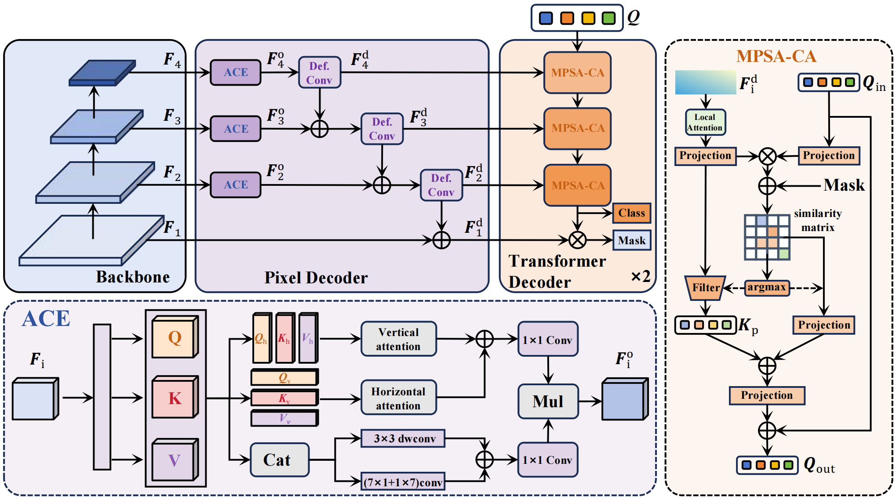
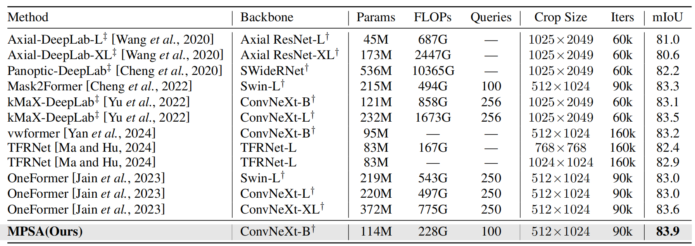

# MPSA




## Table of Contents

- [Installation](#installation)
- [Data preparation](#data-preparation)
- [Training](#training)
- [Testing](#training)

## Installation

The code has been tested with `python>=3.8` and `pytorch==1.12.0`. To prepare the conda environment please run the following:

```bash
conda create --name mpsa python=3.10 -y
conda activate mpsa

conda install pytorch==1.12.0 torchvision==0.13.0 torchaudio==0.12.0 cudatoolkit=11.3 -c pytorch
python -m pip install 'git+https://github.com/facebookresearch/detectron2.git'

cd mpsa
pip install -r requirements.txt
```

## Data preparation

For the dataset preparation, plese refer to the [Mask2Former guide](https://github.com/facebookresearch/Mask2Former/blob/main/datasets/README.md).

## Training

To train the model with `train_net.py`, run the following

```bash
python train_net.py --num-gpus 4 \
  --config-file configs/cityscapes/semantic-segmentation/convnext/mpsa_convnext_base_bs16_90k.yaml
```

## Testing

To test the model, you can use `train_net.py` with the flag `--eval-only` along with the checkpoint path of the trained model.

```bash
python train_net.py --eval-only \
  --config-file configs/cityscapes/semantic-segmentation/convnext/mpsa_convnext_base_bs16_90k.yaml \
  MODEL.WEIGHTS /path/to/checkpoint_file
```
